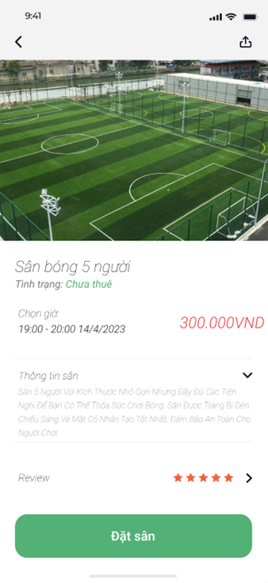

  

# Sport Management App

Sport Management is an Android application designed for users to easily book sports fields, check field availability, and purchase beverages during their sports events. The app is developed in Java, utilizing Firebase as the database for efficient data management.

## Table of Contents

- [Sport Management App](#sport-management-app)
  - [Table of Contents](#table-of-contents)
  - [Features](#features)
    - [Customer Features](#customer-features)
    - [Admin Features](#admin-features)
  - [Installation](#installation)
  - [Technologies Used](#technologies-used)
  - [Contact](#contact)

## Features

### Customer Features

- **Schedule and Manage Sports Events:**
  - Users can easily book sports fields and manage their scheduled sports events through the app.

- **Online Payments via ZaloPay:**
  - Seamless support for online payments through ZaloPay, ensuring a secure and convenient payment experience.

- **Account Information Management:**
  - Users have the capability to manage their account information, ensuring a personalized experience within the app.

### Admin Features

- **CRUD Operations:**
  - Admins have full control over schedules, sports fields, beverages, and customer information through Create, Read, Update, and Delete operations.

- **Payment Support for Customers:**
  - Admins can provide assistance and support for customer payments, ensuring a smooth transaction process.

## Installation

To use the Sport Management app, follow these simple steps:

1. Clone the repository to your machine `git clone https://github.com/DucTai0909/NT118.N21_Sport-Management-App.git`.
2. Open the project in Android Studio or your preferred IDE.
3. Build the project.
4. Run the app on an Android Virtual Device (AVD) or a physical Android device with a minimum Android version of 8 (Oreo).

## Technologies Used

- **Development Language:**
  - Java

- **Database:**
  - Firebase

## Contact

For any inquiries or support, please contact us at nguyentoductai@gmail.com
